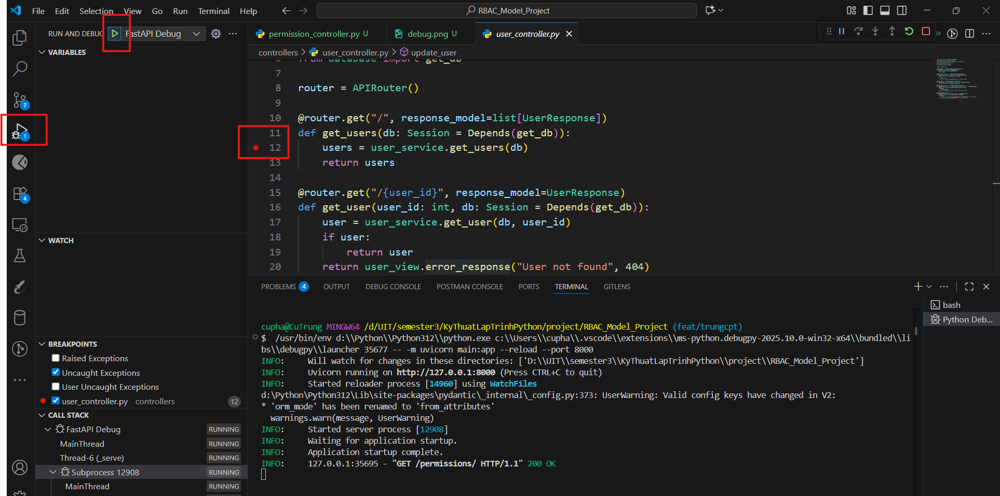
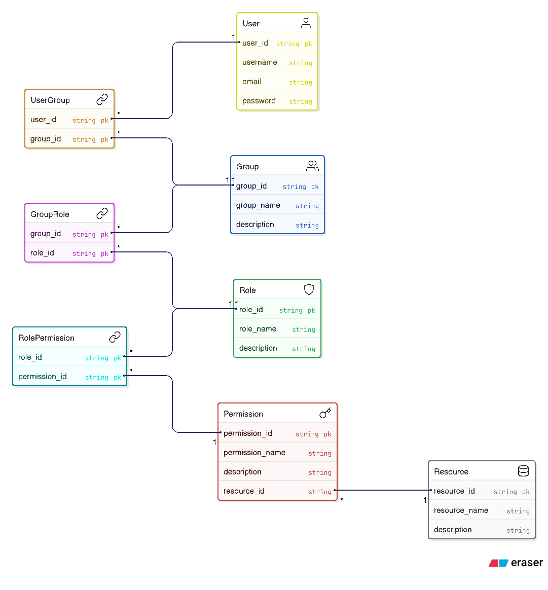

# Install

```
py -m pip install "fastapi[standard]"
```

```
py -m pip install [Các package cần thiết khác]
```

# Run

```
py -m fastapi dev main.py
```

# Open API

```
http://127.0.0.1:8000/docs
```

# Debug



# Diagram


